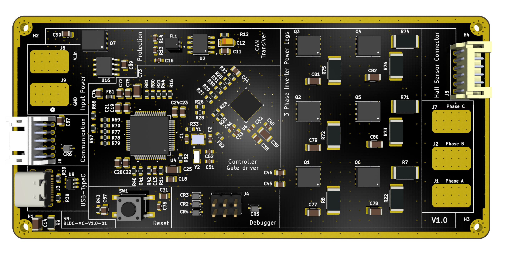
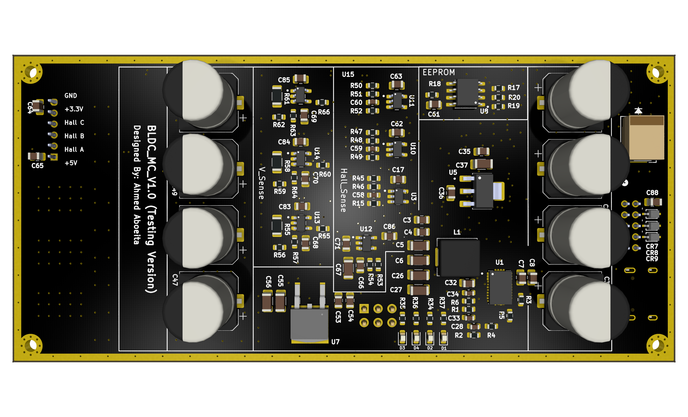

# 3-Phase BLDC & PMSM Motor Controller (ESC)

[](Hardware/BLDC_MC_V1.0/)
[-blue)](https://www.st.com/en/microcontrollers-microprocessors/stm32g431rb.html)
[](https://www.ti.com/product/DRV8353)
[](Hardware/BLDC_MC_V1.0/)
[](https://www.kicad.org/)

A high-performance, compact 3-phase Field-Oriented Control (FOC) Brushless DC (BLDC) and Permanent Magnet Synchronous Motor (PMSM) driver designed for robotics, e-mobility, actuators, and industrial automation.

This repository contains the complete end-to-end design stack:
* **Hardware:** Production-ready 8-layer PCB design (KiCad 10), complete multi-sheet schematics, BOM, Gerbers, assembly files, and LTspice circuit simulations.
* **Firmware:** Embedded C project for STM32G431 utilizing hardware CORDIC/FMAC acceleration, advanced motor timers, ADCs, and industrial communication stacks.
* **Control Modeling:** MATLAB/Simulink system-level simulation models for FOC algorithm development, parameter tuning, and sensorless state estimation.

---

## Hardware Preview (BLDC_MC_V1.0)






---

## Hardware V1.0 Summary & Highlights

The **BLDC_MC_V1.0** hardware design is **completed, verified, and packaged for manufacturing**.

### Key Technical Specifications

| Parameter | Specification | Details / Subsystem |
| :--- | :--- | :--- |
| **Operating Voltage ($V_{BUS}$)** | **24 V – 60 V** (60 V max) | Active reverse-polarity protection + TVS transient clamping |
| **Rated Phase Current** | **30 A continuous / peak** | Low $R_{DS(on)}$ MOSFETs + 8-layer high-copper thermal dissipation |
| **PWM Switching Frequency** | Up to **100 kHz** | Driven by STM32 advanced motor control timers |
| **Microcontroller** | **STM32G431RBT6** | 170 MHz ARM Cortex-M4, FPU, CORDIC & FMAC co-processors |
| **Gate Driver IC** | **TI DRV8353HRTAR** | Smart gate driver ($1.4\,\text{A}$ source / $700\,\text{mA}$ sink), $V_{DS}$ monitor |
| **Power Inverter Stage** | 6x **Infineon BSC027N10NS5** | 100 V, $2.7\,\text{m}\Omega$, SuperSO-8 (TDSON-8) with RC snubbers |
| **Current Sensing** | 3x **$1\,\text{m}\Omega$ Shunts** | Low-side 3-shunt sensing with shielded 4-wire Kelvin routing |
| **Voltage / BEMF Sensing** | 3-Phase Resistor Dividers | Buffered with active $+1.65\,\text{V}$ virtual ground (TLV9061) |
| **Position Feedback** | Hall Sensors + Encoders | Buffered 5 V to 3.3 V Hall inputs with RC filtering |
| **Onboard Memory** | **256 Kbit SPI EEPROM** | Microchip 25LC256 for calibration parameters & PID profiles |
| **Connectivity** | **CAN / CAN-FD, USB-C, UART, I2C** | TCAN334DR transceiver + USBLC6-2SC6 ESD protection |
| **Auxiliary Power Supplies** | **12 V / 5 V / 3.3 V** | LM74700 Ideal Diode, 12V Buck, NCV4274 (5V), LDL1117 (3.3V) |
| **PCB Form Factor** | **8-Layer High-TG180 FR4** | 2 oz outer copper, controlled impedance, 1.65 mm thickness |

---

## Repository Structure

```text
BLDC_Motor_Driver/
├── Control_Modeling/       # MATLAB & Simulink models for FOC algorithm simulation
├── Firmware/               # STM32G431 embedded C firmware (STM32CubeIDE)
└── Hardware/               # Hardware designs, simulations & manufacturing files
    ├── BLDC_MC_V1.0/       # KiCad design, schematics, BOM, Gerbers & 3D renders
    └── Simulation/         # LTspice circuit simulations
```

---

## Project Development Status

| Subsystem | Milestone | Status | Details |
| :--- | :--- | :---: | :--- |
| **Hardware (V1.0)** | Schematic & PCB Layout | **Completed** | 10 modular schematic sheets, DRC passed, 8-layer stackup |
| **Hardware (V1.0)** | Fabrication Files (Gerbers/BOM/PnP) | **Completed** | Full manufacturing package generated in [`Output_Job_files`](Hardware/BLDC_MC_V1.0/Output_Job_files/) |
| **Hardware (V1.0)** | Circuit Simulations | **Completed** | Hall sensor conditioning and active virtual-ground voltage sensor validated |
| **Firmware** | BSP & Low-level Drivers | **In Progress** | STM32G431 peripheral configuration (PWM timers, ADCs, SPI, CAN, UART) |
| **Firmware** | FOC & Commutation Algorithms | **In Progress** | Space Vector PWM (SVPWM), Park/Clarke transforms, current control loop |
| **Control Modeling** | System-Level Simulation | **In Progress** | Simulink motor and inverter models for tuning PI loops & observing dynamics |

---

## Detailed Hardware Documentation & Deliverables

For full details on the schematic sheet breakdown, connector pinouts, controlled impedance layout rules, and fabrication deliverables, refer to:
* **[Hardware V1.0 Comprehensive Documentation](Hardware/BLDC_MC_V1.0/Readme.md)**
* **[Hardware Versions & Overview](Hardware/Readme.md)**
* **[Schematic PDF](Hardware/BLDC_MC_V1.0/Output_Job_files/Board_SCH/BLDC_MC_V1.0.pdf)**
* **[Bill of Materials (BOM)](Hardware/BLDC_MC_V1.0/Output_Job_files/BOM_File/BLDC_MC_V1.0_PDF.pdf)**
* **[Fabrication Gerber Files](Hardware/BLDC_MC_V1.0/Output_Job_files/Fabrication_Files/)**

---

## Author & Project Information

* **Lead Hardware Engineer:** Ahmed Aboeita
* **Design Tools:** KiCad 10.0.5, STM32CubeIDE, MATLAB / Simulink, LTspice
